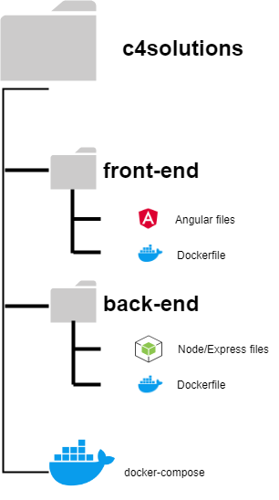

# BackEnd

## File structure for the project



# API Documentation

---

# Introduction
This document aims to describe the designed functionality of the NFC Storage Tracker API, created for the Swedish National Forensic Centre through the software project course TDDC88. 

Since the host of the application is yet to be decided, the host used for example requests in this document will be `localhost` and port `9000` as these corresponds to the setup of our development environment.

All messages sent to the API application is required to be in JSON format. 

# Authentication 
The backend application uses session-based authentication. This means that the server makes use of cookies stored in the user's browser in order to verify their identity after Login. In order to access the backend, a user must therefore go through the frontend application and login go through the login process. This will save the required cookies in the user's browser which will be sent with each request to the backend.

Unless otherwise specified, all endpoints listed in this document requires authentication in the form described above.

**NOTE:** No requests are checked for authentication if the NODE_ENV environment variable for the backend application is set to 'debug'.

# Branches
## Get all branches 
This endpoint gets all available branches
##### HTTP Request
`GET http://localhost:9000/branch`

##### HTTP Response
The endpoint returns JSON data structured like this:
```json
[
    {
        "id": 5,
        "name": "Bio-analys"
    },
    {
        "id": 1,
        "name": "DNA"
    },
    ...
]
```

## Create a new branch
This endpoint creates a new branch
##### HTTP Request
`POST http://localhost:9000/branch`

Example body to send:
```json
{
    "name": "New branch"
}
```
##### HTTP Response
If successful, the response will be the updated branch object:
```json
{
    "id": 2,
    "name": "New branch"
}
```

##### JSON Parameters 
Parameter | Description
--------- | -----------
name | The new name of the new branch.

## Update a branch
This endpoint updates a specific branch
##### HTTP Request
`PUT http://localhost:9000/branch/<ID>`

##### URL Parameters
Parameter | Description
--------- | -----------
ID | The ID of the branch to update

##### JSON Parameters 
Parameter | Required | Description
--------- | ------- | -----------
name | yes | The new name of the branch to update.

Example body to send:
```json
{
    "name": "Updated branch name"
}
```

##### HTTP Response
If successful, the response will be the updated branch object:
```json
{
    "id": 4,
    "name": "Updated branch name"
}
```


## Delete a branch
This endpoint deletes a specific branch
##### HTTP Request
`DELETE http://localhost:9000/branch/<ID>`
##### URL Parameters
Parameter | Description
--------- | -----------
ID | The ID of the branch to delete

##### HTTP Response
If successful, the response will be a status message:
```json
{
    "result": "ok" 
}
```

# Storageroom 

## Update a storage room
This endpoint updates a specific storage room
##### HTTP Request
`PUT http://localhost:9000/storageroom/<ID>`
##### URL Parameters
Parameter | Description
--------- | -----------
ID | The ID of the storage room to update

##### JSON Parameters 
Parameter |Description
--------- | -----------
name | The updated name of the storage room subject to change.
branch | The updated id of the branch to which the storage room belongs to.

Example body of request:
```json
{
    "name": "Updated storage room name",
    "branch": 3
}
```

##### HTTP Response
If successful, the response will be the updated storage room object:
```json
{
    "id": 4,
    "name": "Updated storage room name",
    "branch": 3
}
```


## Create a new storage room
This endpoint creates a new storage room
##### HTTP Request
`POST http://localhost:9000/storageroom`

##### JSON Parameters 
Parameter |Description
--------- | -----------
name | The name of the new storage room.
branch | The id of the branch to which the storage room belongs to.

Example body of request:
```json
{
    "name": "New storage room name",
    "branch": 3
}
```

##### HTTP Response
If successful, the response will be the updated storage room object:
```json
{
    "id": 4,
    "name": "New storage room name",
    "branch": 3
}
```

## Delete a storage room
This endpoint deletes a specific branch
##### HTTP Request
`DELETE http://localhost:9000/storageroom/<ID>`
##### URL Parameters
Parameter | Description
--------- | -----------
ID | The ID of the storage room to delete

##### HTTP Response
If successful, the response will be a status message:
```json
{
    "result": "ok" 
}
```

## Get all storage rooms 
This endpoint gets all available storage rooms
##### HTTP Request
`GET http://localhost:9000/storageroom`

##### HTTP Response
The endpoint returns JSON data structured like this:
```json
[
    {
        "id": 1,
        "branch": 1,
        "name": "DNA materialrum 1"
    },
    {
        "id": 2,
        "branch": 2,
        "name": "Vapen materialrum"
    },
    ...
]
```

## Get all storage rooms for a specific branch
This endpoint gets all available storage rooms belonging to a specific branch
##### HTTP Request
`GET http://localhost:9000/storageroom/branch/<ID>`

##### URL Parameters
Parameter | Description
--------- | -----------
ID | The ID of the specific branch

##### HTTP Response
The endpoint returns JSON data structured like this:
```json
[
    {
        "id": 1,
        "branch": 1,
        "name": "DNA materialrum 1"
    },
    {
        "id": 3,
        "branch": 1,
        "name": "DNA materialrum 2"
    },
    ...
]
```
# Storage event

## Get all storage events
This endpoint returns all storage events

##### HTTP Request
`GET http://localhost:9000/storageevent`

##### HTTP Response
The endpoint returns JSON data structured like this:
```json
[
    {
        "id": 1,
        "action": "checked_out",
        "timestamp": 1579679491,
        "user": "1688042193699",
        "comment": null,
        "package": null,
        "shelf": "Hylla 8",
        "storage_room": "DNA materialrum 2",
        "article": 58
    },
    {
        "id": 2,
        "action": "checked_in",
        "timestamp": 1539888637,
        "user": "1649081444199",
        "comment": null,
        "package": null,
        "shelf": "B3",
        "storage_room": "DNA materialrum 1",
        "article": 43
    },
    ...
]
```

## Get all storage events for a specific article 
This endpoint returns all storage event involving a specific article

##### HTTP Request
`GET http://localhost:9000/storageevent/article/<ID>`

##### URL Parameters
Parameter | Description
--------- | -----------
ID | The ID of the specific article

##### HTTP Response
The endpoint returns JSON data structured like this:
```json
[
    {
        "id": 5,
        "action": "checked_in",
        "timestamp": 1789387489,
        "user": 0972373831,
        "comment": "",
        "package": "",
        "shelf": "A15",
        "storage_room": "Vapen materialrum 1",
        "article": 17
    },
    ...
]
```

## Get all storage events for a specific storage room
This endpoint returns all storage event involving a specific storage room

##### HTTP Request
`GET http://localhost:9000/storageevent/storageroom/<ID>`

##### URL Parameters
Parameter | Description
--------- | -----------
ID | The ID of the specific storage room

The endpoint returns JSON data structured like this:
```json
[
    {
        "id": 5,
        "action": "checked_in",
        "timestamp": 1789387489,
        "user": 0972373831,
        "comment": "",
        "package": "",
        "shelf": "A15",
        "storage_room": "Vapen materialrum 1",
        "article": 17
    },
    ...
]
```

# Article

## Create a new article
This endpoint creates a new article
##### HTTP Request
`POST http://localhost:9000/article`

##### JSON Parameters 
Parameter | Required | Description
--------- | ----------- | -----------
material_number | yes | The name complete material number of the article. I.e. reference-number + article-number.
reference_number | yes | The reference number of the case associated with the article
description | no | Optional description of the article

Example body of request:
```json
{
    "material_number": "129274-90",
    "reference_number": "129274",
    "description": "Gun"
}
```
##### HTTP Response
If successful, the response will be the created article:
```json
{
    "material_number": "129274-90",
    "reference_number": "129274",
    "description": "Gun",
    "id": 4
}
```

## Check in article 
This endpoint checks in an existing article in a storage room with shelf/package. If an article with the specified material number does not exist, the response will return an error code. 

##### HTTP Request
`POST http://localhost:9000/article/check-in`

##### JSON Parameters 
Parameter | Required | Description
--------- | ----------- | -----------
material_number | yes | The name complete material number of the article. I.e. reference-number + article-number.
comment | no | Optional comment describing the reason behind the check-in
storage_room | yes | The id of the storage room where the check in was made
shelf | yes, if package not supplied  | The id of the shelf where the check in was made
package | no | The id of the package to which the material was checked in  

Example body of request where shelf was specified:
```json
{
    "material_number": "129274-90",
    "comment": "Return gun after lab examination",
    "storage_room": 3,
    "shelf": 6,
}
```

Example body of request where package instead was specified:
```json
{
    "material_number": "129274-90",
    "comment": "Return gun after lab examination",
    "storage_room": 3,
    "package": 2,
}
```
##### HTTP Response
If the check in was successful, the response will be the storage event that was created:
```json
{
    "id": 67,
    "action": "checked_in",
    "timestamp": 1579679491,
    "user": "1688042193699",
    "comment": "",
    "package": null,
    "shelf": "Hylla 8",
    "storage_room": "DNA materialrum 2",
    "article": 58
}
```

## Check out article 
This endpoints checks out an existing article from a storage room. If an article with the specified material number does not exist, the response will return an error code. 

##### HTTP Request
`POST http://localhost:9000/article/check-out`

##### JSON Parameters 
Parameter | Required | Description
--------- | ----------- | -----------
material_number | yes | The name complete material number of the article. I.e. reference-number + article-number.
comment | no | Optional comment describing the reason behind the check-in
storage_room | yes | The id of the storage room where the check out was made

Example body of request:
```json
{
    "material_number": "129274-90",
    "comment": "Checked out for lab examination",
    "storage_room": 3,
}
```
##### HTTP Response
If the check out was successful, the response will be the storage event that was created:
```json
{
    "id": 67,
    "action": "checked_out",
    "timestamp": 1579679491,
    "user": "1688042193699",
    "comment": "Checked out for lab examination",
    "package": null,
    "shelf": "Hylla 8",
    "storage_room": "DNA materialrum 2",
    "article": 58
}
```

## Register new article 
This endpoints registers a new article and creates a first check-in in a storage room with shelf/package. If an article with the specified material number already exists, the response will return an error code. 

##### HTTP Request
`POST http://localhost:9000/article/register`

##### JSON Parameters 
Parameter | Required | Description
--------- | ----------- | -----------
material_number | yes | The name complete material number of the article. I.e. reference-number + article-number.
description | no | Optional description of the article
comment | no | Optional comment describing the reason behind the check-in
storage_room | yes | The id of the storage room where the check in was made
shelf | yes, if package not supplied  | The id of the shelf where the check in was made
package | no | The id of the package to which the material was checked in  

Example body of request where shelf was specified:
```json
{
    "material_number": "129274-90",
    "description": "Gun",
    "comment": "Handled at package center",
    "storage_room": 3,
    "shelf": 6,
}
```

Example body of request where package instead was specified:
```json
{
    "material_number": "129274-90",
    "description": "Gun",
    "comment": "Handled at package center",
    "storage_room": 3,
    "package": 2,
}
```
##### HTTP Response
If the registration was successful, the response will be the storage event that was created:
```json
{
    "id": 67,
    "action": "checked_in",
    "timestamp": 1579679491,
    "user": "1688042193699",
    "comment": "Handled at package center",
    "package": null,
    "shelf": "Hylla 8",
    "storage_room": "DNA materialrum 2",
    "article": 58
}
```


## Get all articles
This endpoint returns all articles.

##### HTTP Request
`GET http://localhost:9000/article`

##### HTTP Response
Example response:
```json
[
    {
        "material_number": "743996-44",
        "reference_number": "743996",
        "storage_room": "Vapen 1",
        "package": " - ",
        "shelf": "B3",
        "status": "check_out",
        "timestamp": 1552942078,
        "last_modified": 1552942078,
        "description": ""
    },
    {
        "material_number": "505841-57",
        "reference_number": "505841",
        "storage_room": "Vapen 1",
        "shelf": "B10",
        "package": " - ",
        "status": "check_in",
        "timestamp": 1549895201,
        "last_modified": 1549895201,
        "description": "Gevärspipa"
    },
    ...
]
```

## Get specific article
This endpoint returns a specific article.

##### HTTP Request
`GET http://localhost:9000/article/<ID>`

##### URL Parameters
Parameter | Description
--------- | -----------
ID | The ID of the specific article

##### HTTP Response
Example response:
```json
{
    "material_number": "505841-57",
    "reference_number": "505841",
    "storage_room": "Vapen 1",
    "shelf": "B10",
    "package": " - ",
    "status": "check_in",
    "timestamp": 1549895201,
    "last_modified": 1549895201,
    "description": "Gevärspipa"
}
```

## Get all articles for a specific case
This endpoint returns all articles belonging to a specific case.
##### HTTP Request
`GET http://localhost:9000/article/case/<ID>`

##### URL Parameters
Parameter | Description
--------- | -----------
ID | The ID of the specific case

##### HTTP Response
Example response:
```json
 [ 
    {
        "material_number": "743996-44",
        "reference_number": "743996",
        "storage_room": "Vapen 1",
        "shelf": "B3",
        "package": " - ",
        "status": "check_out",
        "timestamp": 1552942078,
        "last_modified": 1552942078,
        "description": "",
        "id": 12
    },
    {
        "material_number": "743996-57",
        "reference_number": "743996",
        "storage_room": "Vapen 1",
        "shelf": "B10",
        "package": " - ",
        "status": "check_in",
        "timestamp": 1549895201,
        "last_modified": 1549895201,
        "description": "Gevärspipa",
        "id": 18
    },
    ...
]
```

## Get all articles stored by a specific branch
This endpoint returns all articles currently stored by the branch with the specified id.
##### HTTP Request
`GET http://localhost:9000/article/branch/<ID>`

##### URL Parameters
Parameter | Description
--------- | -----------
ID | The ID of the specific branch

##### HTTP Response
Example response:
```json
 [ 
    {
        "material_number": "743996-44",
        "reference_number": "743996",
        "storage_room": "Vapen 1",
        "shelf": "B3",
        "package": " - ",
        "status": "check_out",
        "timestamp": 1552942078,
        "last_modified": 1552942078,
        "description": "",
        "id": 12
    },
    {
        "material_number": "505841-57",
        "reference_number": "505841",
        "storage_room": "Vapen 1",
        "shelf": "B10",
        "package": " - ",
        "status": "check_in",
        "timestamp": 1549895201,
        "last_modified": 1549895201,
        "description": "Gevärspipa",
        "id": 18
    },
    ...
]
```

## Get all articles currently in a specific storage room
This endpoint returns all articles currently stored by a specific storage room.

##### HTTP Request
`GET http://localhost:9000/article/storageroom/<ID>`

##### URL Parameters
Parameter | Description
--------- | -----------
ID | The ID of the specific storage room

##### HTTP Response
Example response:
```json
[
  {
        "material_number": "743996-44",
        "reference_number": "743996",
        "storage_room": "Vapen 1",
        "shelf": "B3",
        "package": " - ",
        "status": "check_out",
        "timestamp": 1552942078,
        "last_modified": 1552942078,
        "description": "",
        "id": 12
    },
    {
        "material_number": "505841-57",
        "reference_number": "505841",
        "storage_room": "Vapen 1",
        "shelf": "B10",
        "package": " - ",
        "status": "check_in",
        "timestamp": 1549895201,
        "last_modified": 1549895201,
        "description": "Gevärspipa",
        "id": 18
    },
    ...
]
```

## Get all articles currently in a specific package
This endpoint returns all articles currently in a specific package.

##### HTTP Request
`GET http://localhost:9000/article/package/<ID>`

##### URL Parameters
Parameter | Description
--------- | -----------
ID | The ID of the specific package

##### HTTP Response
Example response:
```json
[
    {
        "material_number": "505841-01",
        "reference_number": "505841",
        "storage_room": "Vapen 1",
        "package": "505841-K01",
        "shelf": "B3",
        "status": "checked_out",
        "timestamp": 1552942078,
        "last_modified": 1552942078,
        "description": "",
        "id": 12
    },
    {
        "material_number": "505841-02",
        "reference_number": "505841",
        "storage_room": "Vapen 1",
        "shelf": "B3",
        "package": "505841-K01",
        "status": "checked_in",
        "timestamp": 1549895201,
        "last_modified": 1549895201,
        "description": "Gevärspipa",
        "id": 18
    },
    ...
]
```
# Case

## Get all cases 
This endpoint gets all cases
##### HTTP Request
`GET http://localhost:9000/case`

##### HTTP Response
The endpoint returns JSON data structured like this:
```json
[
    {
        "id": 7,
        "reference_number": "013931"
    },
    {
        "id": 51,
        "reference_number": "040340"
    },
    ...
]
```

## Get a specific case 
This endpoint returns information about a specific case
##### HTTP Request
`GET http://localhost:9000/case/<ID>`

##### URL Parameters
Parameter | Description
--------- | -----------
ID | The ID of the specific case

##### HTTP Response
The endpoint returns JSON data structured like this:
```json
{
    "id": 7,
    "reference_number": "013931"
}
```

# Search

## Search for articles
This endpoint returns a list of articles matching a specified query
##### HTTP Request
`GET http://localhost:9000/search?parameter_1=value_1&parameter_2=value2`

##### URL Query Parameters
Parameter | Description
--------- | -----------
reference_number | Reference number for the searched article
material_number | Material number for the searched article
storage_room | Storage room name for the searched article
shelf | Shelf name for the searched article
package_number | Package number for the searched article

The endpoint returns JSON data structured like this:
```json
[
  {
        "material_number": "743996-44",
        "reference_number": "743996",
        "storage_room": "Vapen 1",
        "shelf": "B3",
        "package": " - ",
        "status": "check_out",
        "timestamp": 1552942078,
        "last_modified": 1552942078,
        "description": "",
        "id": 12
    }
]
```

# Package

## Check in a package 
This endpoint checks in a pacakge in a storage room and shelf. If a package with the specified package number does not exist, the response will return an error code. A check in of a package will result in a check-in event for **all** articles in the specified package and update the location of these articles.

##### HTTP Request
`POST http://localhost:9000/package/check-in`

##### JSON Parameters 
Parameter | Required | Description
--------- | ----------- | -----------
package_number | yes | The name complete material number of the article. I.e. reference-number + article-number.
comment | no | Optional comment describing the reason behind the check-in
storage_room | yes | The id of the storage room where the check in was made
shelf | yes | The id of the shelf where the check in was made

Example body of request where shelf was specified:
```json
{
    "package_number": "129274-K01",
    "comment": "Move package from Weapon storage to DNA storage",
    "storage_room": 3,
    "shelf": 6,
}
```

##### HTTP Response
If the check in was successful, the response will be a status message:
```json
{
    "result:": "ok
}
```

## Check out a package 
This endpoint checks out a pacakge in from storage room. If a package with the specified package number does not exist, the response will return an error code. A check out of a package will result in a check-out event for **all** articles in the specified package update the location of these articles.

##### HTTP Request
`POST http://localhost:9000/package/check-out`

##### JSON Parameters 
Parameter | Required | Description
--------- | ----------- | -----------
package_number | yes | The name complete material number of the article. I.e. reference-number + article-number.
comment | no | Optional comment describing the reason behind the check-in
storage_room | yes | The id of the storage room where the check in was made

Example body of request where shelf was specified:
```json
{
    "package_number": "129274-K01",
    "comment": "Check out package from DNA storage",
    "storage_room": 3
}
```

##### HTTP Response
If the check in was successful, the response will be a status message:
```json
{
    "result:": "ok
}
```

## Get all packages
This endpoint returns all packages
##### HTTP Request
`GET http://localhost:9000/package`

##### HTTP Response
The endpoint returns JSON data structured like this:
```json
[
    {
        "id": 51,
        "package_number": "515426-K01",
        "shelf": 41,
        "case": 23,
        "current_storage_room": 6
    },
    {
        "id": 52,
        "package_number": "129274-K01",
        "shelf": 34,
        "case": 61,
        "current_storage_room": 3
    },
    ...
]
```

## Get all packages in a specific storage room
This endpoint returns all packages in a specific storage room

##### HTTP Request
`GET http://localhost:9000/package/storageroom/<ID>`

##### URL Parameters
Parameter | Description
--------- | -----------
ID | The ID of the specific storage room

The endpoint returns JSON data structured like this:
```json
[
    {
        "id": 51,
        "package_number": "515426-K01",
        "shelf": 41,
        "case": 23,
        "current_storage_room": 6
    },
    {
        "id": 52,
        "package_number": "129274-K01",
        "shelf": 34,
        "case": 61,
        "current_storage_room": 6
    },
    ...
]
```
## Get all packages under a specific branch
This endpoint returns all packages in storage rooms belonging to a specific branch

##### HTTP Request
`GET http://localhost:9000/package/branch/<ID>`

##### URL Parameters
Parameter | Description
--------- | -----------
ID | The ID of the specific branch

##### HTTP Response
The endpoint returns JSON data structured like this:
```json
[
    {
        "id": 51,
        "package_number": "515426-K01",
        "shelf": 41,
        "case": 23,
        "current_storage_room": 6
    },
    {
        "id": 52,
        "package_number": "129274-K01",
        "shelf": 34,
        "case": 61,
        "current_storage_room": 6
    },
    ...
]
```

## Create a package for a given case
This endpoint creates the next package for a given case. For example, if no packages exists for a certain case (e.g. reference number 12738) this endpoint will create a package with package number 12738-K01. The next time this endpoint is called, 12738-K02 will be created

##### HTTP Request
`POST http://localhost:9000/package/case/<ID>`

##### URL Parameters
Parameter | Description
--------- | -----------
ID | The ID of the case for which to create a new package

##### JSON Parameters 
Parameter |Description
--------- | -----------
current_storage_room | The id of the storage room for the new package
shelf | The the id of the shelf for the new package

Example body of request:
```json
{
    "current_storage_room": 3,
    "shelf": 2
}
```
##### HTTP Response
If successful, the response will be the created package object:
```json
{
    "package_number": "213876-K03",
    "current_storage_room": 3,
    "shelf": 2,
    "id": 4
}
```

## Delete a package
This endpoint deletes a specific package
##### HTTP Request
`DELETE http://localhost:9000/package/<ID>`
##### URL Parameters
Parameter | Description
--------- | -----------
ID | The ID of the package to delete

##### HTTP Response
If successful, the response will be a status message:
```json
{
    "result": "ok" 
}
```

# Shelf

## Get all shelves for storage room
This endpoint returns all shelves for a specific storage room

##### HTTP Request
`GET http://localhost:9000/shelf/storageroom/<ID>`

##### URL Parameters
Parameter | Description
--------- | -----------
ID | The ID of the specific storage room

##### HTTP Response
The endpoint returns JSON data structured like this:
```json
[
    {
        "id": 1,
        "shelf_name": "A1",
        "current_storage_room": 3
    },
    {
        "id": 2,
        "shelf_name": "A2",
        "current_storage_room": 3
    },
    ...
]
```

## Update a shelf 
This endpoint updates a specific shelf

##### HTTP Request
`PUT http://localhost:9000/shelf/<ID>`

##### URL Parameters
Parameter | Description
--------- | -----------
ID | The ID of the shelf to update

##### JSON Parameters 
Parameter |Description
--------- | -----------
shelf_name | The updated shelf name

Example body of request:
```json
{
    "shelf_name": "Updated shelf name"
}
```

##### HTTP Response
If successful, the response will be the created shelf object:
```json
{
    "shelf_name": "Updated shelf name",
    "id": 2
}
```

## Create a new shelf 
This endpoint creates a new shelf for a specific storage room

##### HTTP Request
`POST http://localhost:9000/shelf/storageroom/<ID>`

##### URL Parameters
Parameter | Description
--------- | -----------
ID | The ID of the storage room for which to create a new shelf

##### JSON Parameters 
Parameter |Description
--------- | -----------
shelf_name | The updated shelf name

Example body of request:
```json
{
    "shelf_name": "New shelf name"
}
```

##### HTTP Response
If successful, the response will be the created shelf object:
```json
{
    "shelf_name": "New shelf name",
    "id": 2
}
```

## Delete a shelf 
This endpoint deletes a shelf

##### HTTP Request
`DELETE http://localhost:9000/shelf/<ID>`

##### URL Parameters
Parameter | Description
--------- | -----------
ID | The ID of the shelf to delete

##### HTTP Response
If successful, the response will be a status message:
```json
{
    "result": "ok" 
}
```


